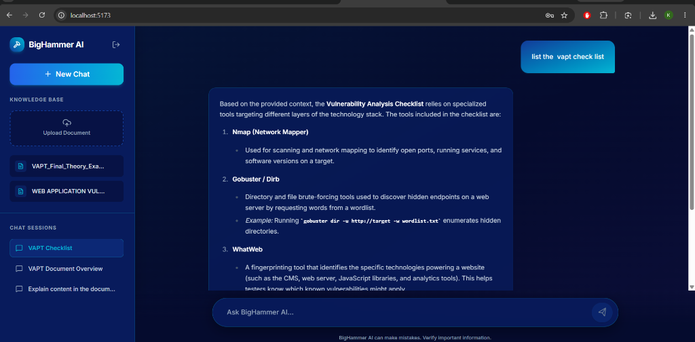

# BigHammer AI

BigHammer AI is a Retrieval-Augmented Generation (RAG) platform, designed for managing knowledge bases and chatting with your documents.

## Dashboard Preview



## Architecture

This project is fully dockerized and uses:
- **Frontend**: React, Vite, Tailwind CSS (Glassmorphism & Deep Blue Theme)
- **Backend**: FastAPI, Python
- **Database**: PostgreSQL with `pgvector`

## Getting Started

Make sure you have Docker Desktop installed and running.

1. Create a `.env` file in the root with your API keys (e.g. `GEMINI_API_KEY=your_key`).
2. Run the application:
```bash
docker compose up --build -d
```
3. Open `http://localhost:5173` in your browser.
